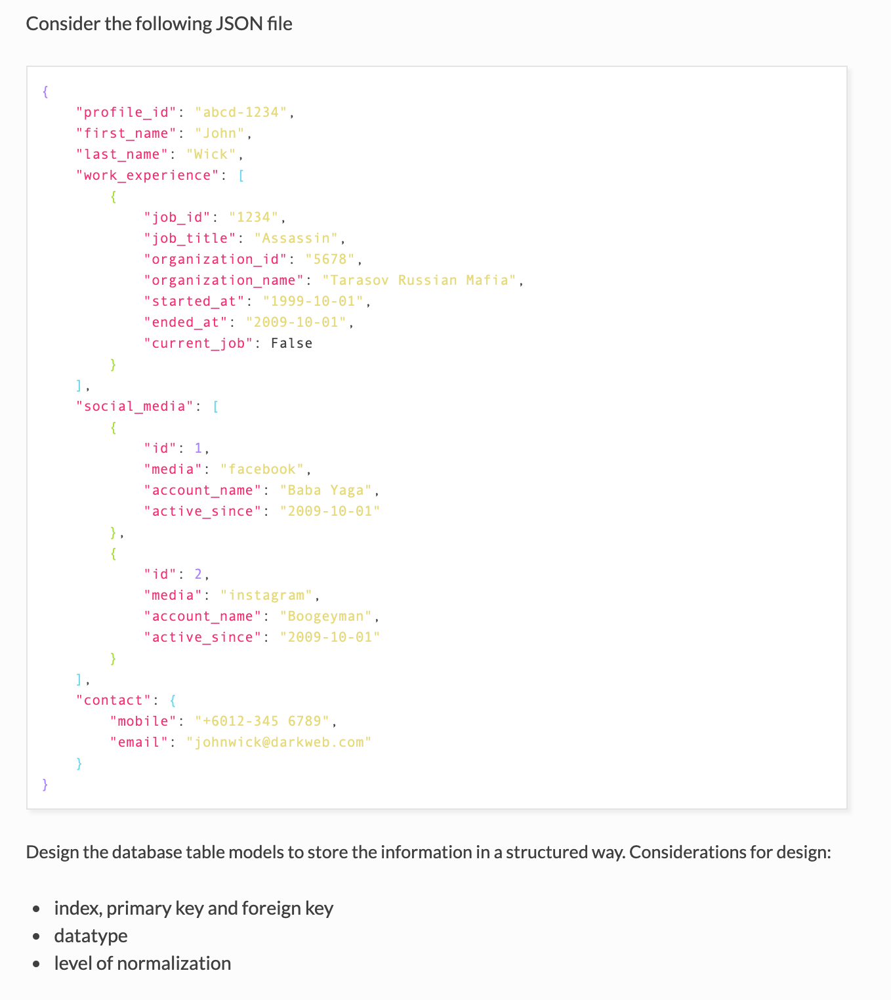
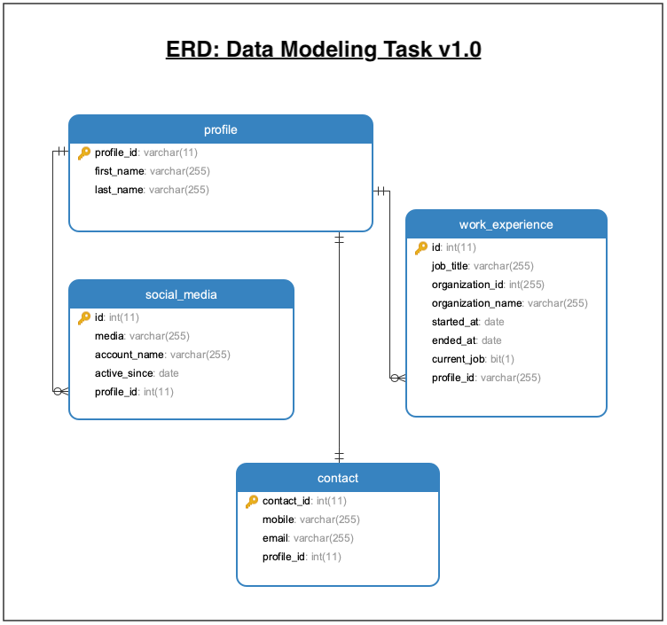

# Data Modeling #
---
## [< All Solutions](https://github.com/naeemark/assessment-pulsifi) ##
---

### Problem Statement:

---

## Attempt ##

### Entity Relationship Diagram ###

### Solution ###
- The solution is designed by doing following steps:

#### **1 - Identify the Entities** ####
- As we can not ignore the needs of known entities before designing a schema for a system. It is important to identify the possible entities.
- By analyzing the provided `json` data, I can easily identify the following entities;
  - **profile** - attributes: [`profile_id, first_name, last_name`]
  - **contact** - attributes: [`mobile, email`]
  - **work-experience** - attributes: [`job_id, job_title, organization_id, organization_name, started_at, ended_at, current_job`]
  - **social_media** - attributes: [`id, media, account_name, active_since`]

#### **2 - Identify the relationships between Entities** ####
- In the provided sample, following relationships are identified between the entities;
  - **profile** *has* **contact** - Its gonna be a `one-to-one` relation; i.e The `profile` can be associated to one contact and vice-versa (According to the provided `json`)
  - **profile** *has* **work-experience** - Its gonna be a `one-to-many` relation; i.e The `profile` can have either multiple or single `work-experience`.  Its a single directional relation, `work-experience` record is dependent on the existence of profile. More, there could be a possibility that a `profile` does not keep any `work-experience`
  - **profile** *has* **social_media** - Each record in `social_media` table indicates a social media account. Again, Its gonna be a `one-to-many` relation; i.e The `profile` can have either multiple or single `social_media` account. But `social_media` can be associated with `one and only one` profile. There could be a possibility that a `profile` does not keep any `social_media` account.

#### **3 - Finalize the Attributes of Entities** ####
 - **profile** - attributes: [`profile_id, first_name, last_name`], PK: `profile_id`
 - **contact** - attributes: [`mobile, email`], PK: `contact_id`, FK: `profile_id`
 - **social_media** - attributes: [`id, media, account_name, active_since`], PK: `id`, FK: `profile_id`
 - **work-experience** - attributes: [`job_id, job_title, organization_id, organization_name, started_at, ended_at, current_job`], PK: `id`, FK: `profile_id`

 *An additional attribute is added in `contact` as PK to achieve default indexing. Its not required by the design though*
 
 *Data types as shown in the Entity Relationship Diagram*

#### **4 - Normalization** ####
- Such systems are normalized upto 3-NF to maintain a balance between data redundancy and inconsistency.
- In our example there is not `many-to-many` relation found. So we don't need to create some reference tables to resolve `many-to-many` into `one-to-many` relationship.
- No fields are redundant in any table except the Foreign-Keys. So, there is no need to decompose any table further. 

### SQL Schema ###
- Query: [schema_data_modeling.sql](../data_modeling/schema_data_modeling.sql)
