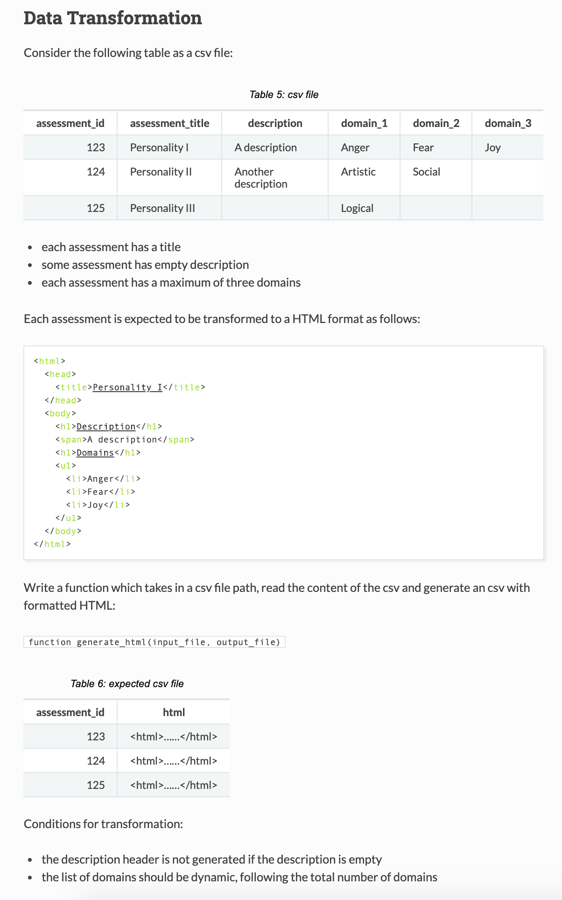

# Data Transformation #

---
## [All Solutions](https://github.com/naeemark/assessment-pulsifi) ##
---

### Problem Statement:

### Attempt ###

 - The solution is provided as below:
    - Implementation file: [data_transformation.py](../python-code/src/data_transformation.py)
    - Unit tests: [test_data_transformation.py](../python-code/src/test_data_transformation.py)
  - Sample data is located at [sample_data](../python-code/data/sample_data.csv)
  - Sample data was obtained from problem statement

### How to set up ###
To set-up the project locally you need to clone this repo, from `master` or `develop` branch or some latest `TAG`
- install `pipenv` if you don't have already

### Project Directory ###
- This python project in located in [python-code](../python-code)
- [python-code](../python-code) is an independent project
- You need to enter in the above directory to `setup` or `run`

### Configuration ###

Please sync and resolve dependencies by using
- `pipenv install`

### Test App
- Activate `virtual environment` `pipenv shell`   
- Run `pytest`   
   OR
- Run `pytest -v` with vorbose   
   OR
- Run `pytest --cov-report term-missing --cov=src --cov-report=html -v && open htmlcov/index.html` to open unit test coverage report

### Pre-reqs

- [python 3.7](https://www.python.org/downloads/release/python-376/)
- [pipenv](https://pipenv-fork.readthedocs.io/en/latest/)
- [pytest](https://docs.pytest.org/en/latest/)
- [pytest-cov](https://pypi.org/project/pytest-cov/)
- [bs4](https://pypi.org/project/beautifulsoup4/)

## Requirements ##

- See [`Pipfile`](../python-code/Pipfile)