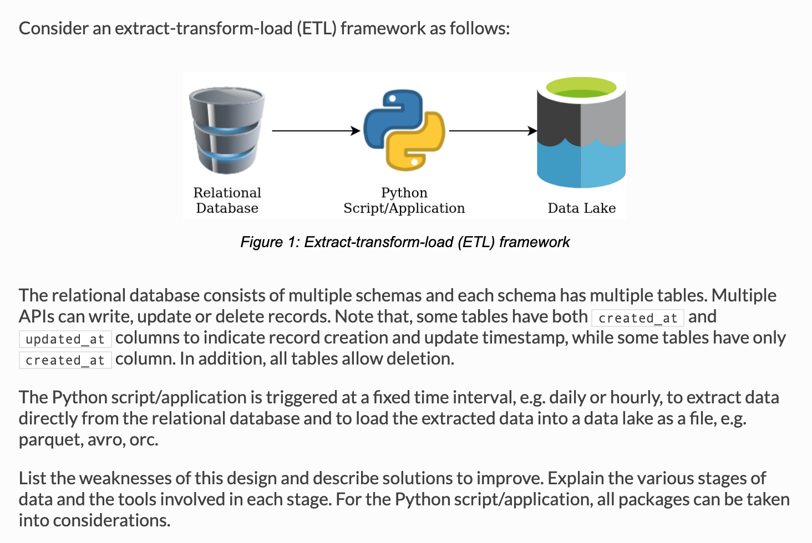

# Extract-Transform-Load Framework #

---
## [< All Solutions](https://github.com/naeemark/assessment-pulsifi) ##
---

## Problem Statement: ##

---

## **Attempt** ##

## Drawbacks and Weaknesses ##
Following weaknesses are revealed upon the analysis.

### Data Synchronization ###
The data is not synchronized between source and destination due to unknown/un-tracked changes on source.
There is a chance that the some user can make any Update/Delete operation on the previous batch of source which was already synced.
But now our migration system in not capable enough to detect and sync the change made on previous batches.

### Re-Attempts to dump the same data ###
To avoid the above mentioned weakness, the python app can re-dump the chunk of data which is supposed to be changed after the previous execution.
There are bright chances that the same data will be migrated and process again. Which is not correct

### Inconsistency  ###
When there is uncertainty about the accuracy of data. The purpose of data-lake will go false due to inconsistent data.

### Rise in Resource Cost  ###
It can happen it multiple ways, either we are utilizing the resources to process same data again and again, or we are keeping the large amout of data on multiple destinations to avoid the loss of data.

### Limitation in the Destination Environment ###
It is mentioned that the destination(data lake) is going keep the data as a file, e.g. parquet, avro. It means that the data lake does not support object updates.
We have to either keep the already placed object or replace it. There is no possibility to update a specific part of file/object, as we can do in database/tables.

---

## Possible Way-outs / Proposal ##

### Improvement in ETL  ###
The ETL python part should be capable enough to process and trim-off the invalid or duplicate data.

### Change Data Capture - CDC  ###
The actual problem in our scenario is the lack of `Change Data Capture`, it becomes worse when several parts of our source are not managing the `updated_at` fields.
There is no way to detect the last changes from database table on every execution of the E-T-L job.
To overcome this issue, we need a proper `CDC`. maybe integrated with the source system or attached to the python-part of ETL.

### Enabling CDC Features of RDBMS  ###
This is another possibility, almost all RDMBS are providing built-in support for CDC already. It will enable us to look into the `Query History`, DML and DDL logs. Due to that, even without the `updated_at` fields, we can overcome the problem.
Apart from this, there is a possibility to maintain own db-operation-logging on the source system
- [Track Data Changes (SQL Server)](https://docs.microsoft.com/en-us/sql/relational-databases/track-changes/track-data-changes-sql-server?view=sql-server-ver15)
- [Performance Schema Transaction Tables](https://dev.mysql.com/doc/refman/8.0/en/performance-schema-transaction-tables.html)

### Ingesting CDC data  ###
The next challenge will be ingestion of CDC data properly and correctly, when there is no chance of partial update of data-lake objects.
This is gonna be an expensive task.

### Enhancing the middle layer (Python part)  ###
Some tools and libs can be used along with python-layer
- py-sqoop
- spark/py-spark
- Databricks Delta
- Debezium
- Kafka for CDC updates

### Relevant AWS Solutions  ###
Following services can be utilized
- AWS Glue
- Athena
- Patching inside AWS environment using Spark
- AWS Kineses with CDC streams

### Assumptions ###
- We have administrative access to make change in source RDMS environment
- We can set triggers to Source database
- Enough processing capacity is available for the middle layer
---
