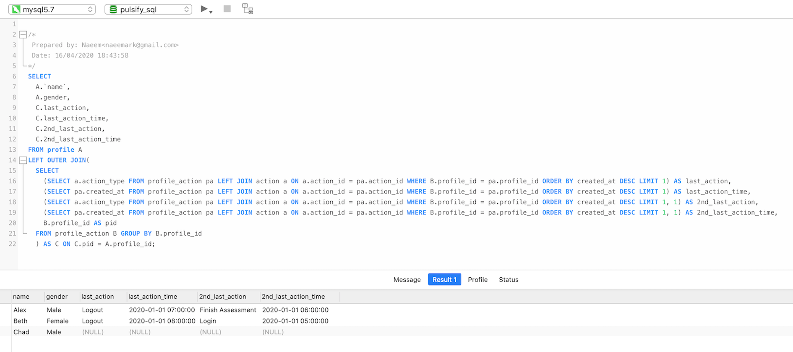

# SQL #

---
## [< All Solutions](https://github.com/naeemark/assessment-pulsifi) ##
---

### Problem Statement:

---

### Attempt ###

- I have tried to use `sql pivot` method to achieve the required results but it was not successful as we need to map multiple rown of aggregated table into columns of `profile` table. And the data is also need to be joined between `profile_action` as well as `action`.
- The working solution is based on inner queries. It doesn't seem to be an efficient solution but at least this is working for the situation.  

 - The solution is provided as below:
    - Database Schema: [sample_schema.sql](../sql/sample_schema.sql)
    - Query: [retrieve_query.sql](../sql/retrieve_query.sql)

### SQL Fiddle ###
- A working solution can be tested on [sqlfiddle](http://sqlfiddle.com/#!9/295c44/2)

### Dev and Test Environment ###

- MySQL 5.7
- MySQL 5.6 [sqlfiddle](http://sqlfiddle.com/#!9/295c44/2)

### Query Result ###
